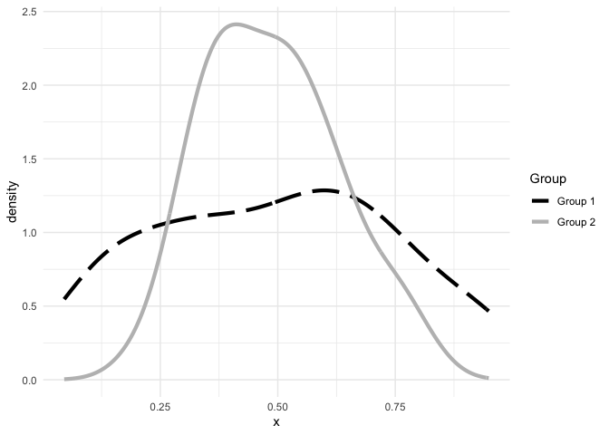
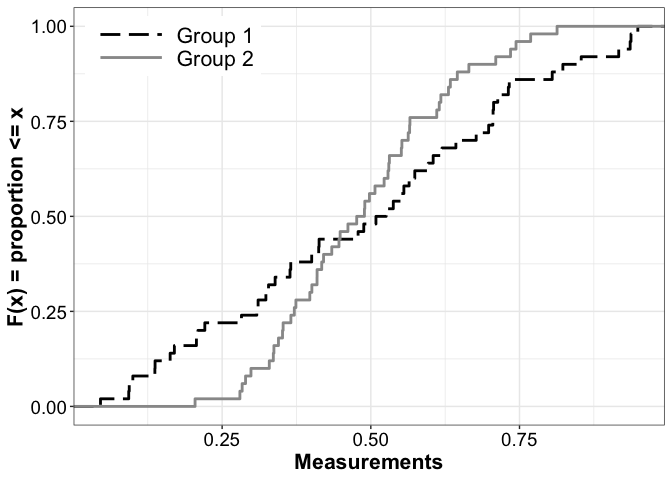
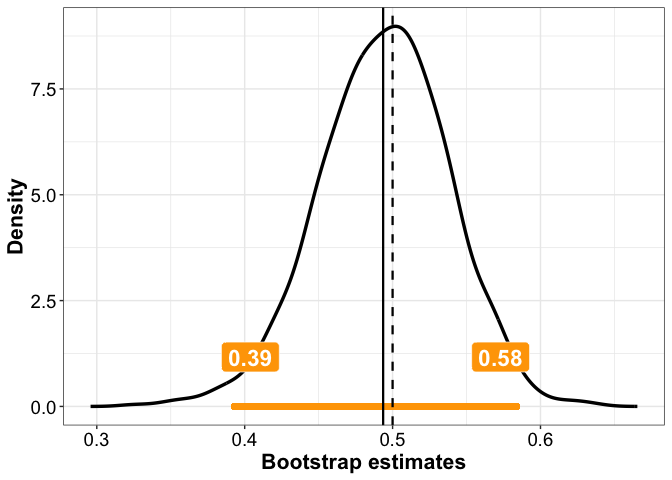
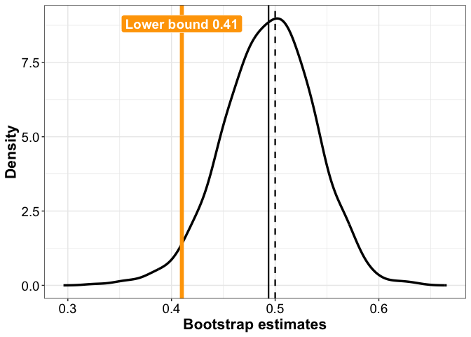
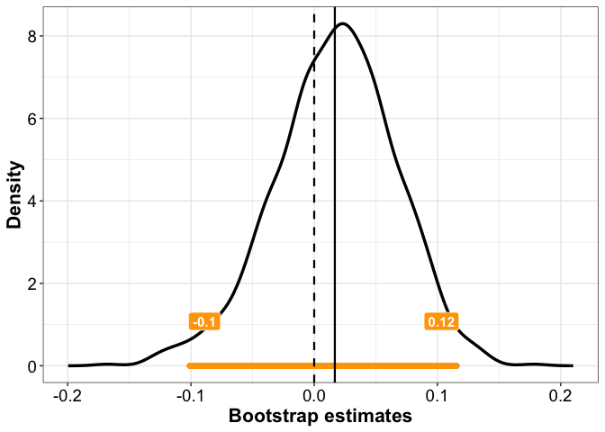
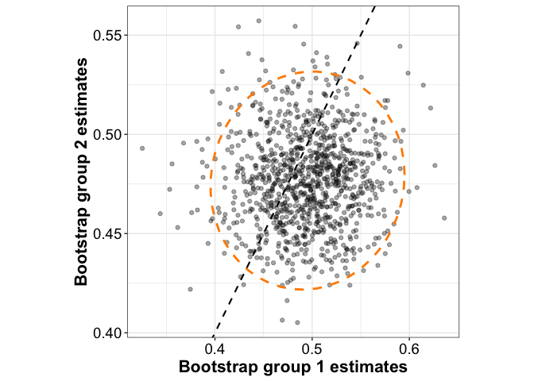
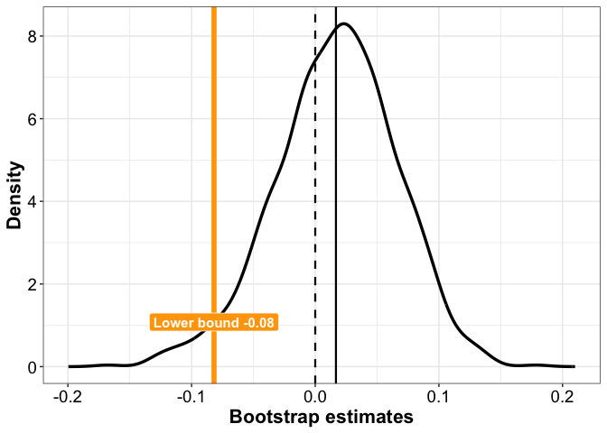
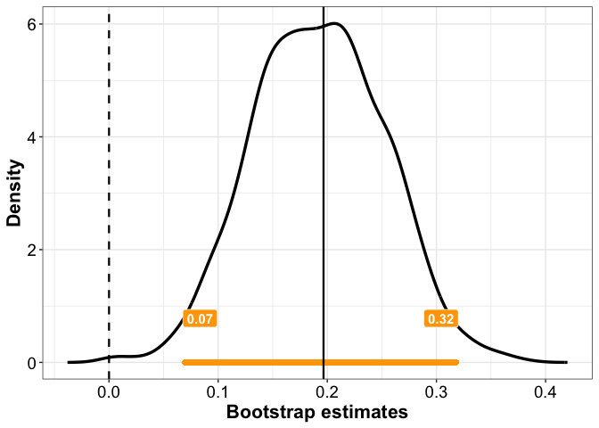
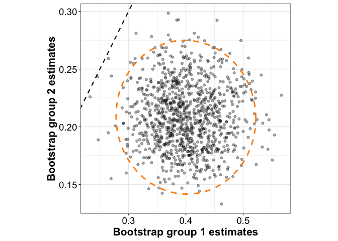
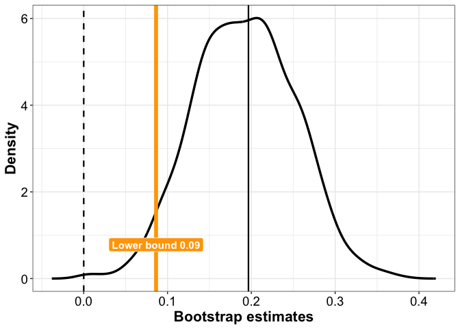

<!-- README.md is generated from README.Rmd. Please edit that file -->

# garstats

<!-- badges: start -->

[](https://github.com/GRousselet/garstats/blob/main/LICENSE.md)
[](https://github.com/GRousselet/garstats)
<!-- badges: end -->

`garstats` is an R package to apply and teach robust inferential
methods. The goal is to cover basic parametric and percentile bootstrap
methods for group comparisons. Plot and utility functions help
illustrate bootstrap results.

## Installation

You can install the development version of `garstats` with this command:

``` r
# install.packages("pak")
pak::pak("GRousselet/garstats")
```

## Content of the R files

### `wilcoxmod.R`

The functions in this file were modified from the original [code from
Rand R. Wilcox](https://osf.io/xhe8u/):

Wilcox, Rand R. 2022. Introduction to Robust Estimation and Hypothesis
Testing. 5th edn. Statistical Modeling and Decision Science. San Diego,
CA: Academic Press.

Some of the main changes include:

- do not remove missing values inside the function

- change default bootstrap samples to 2000

- add option to return two-sided or one-sided p-values and confidence
  intervals

- remove call set.seed() in the functions; it is better practice to set
  the seed outside of the functions

- use quantile() to compute quantiles – default type=6

- export bootstrap distributions

- boostrap p-values are by default corrected for small sample sizes

| Function | Description |
|----|----|
| `hd()` | Harrell-Davis estimate of a quantile. |
| `trimci()` | Parametric one-sample inference for a trimmed mean. |
| `trimcibt()` | One-sample bootstrap-t inference for a trimmed mean. |
| `yuen()` | Parametric inference for two independent trimmed means. |
| `yuenbt()` | Bootstrap-t inference for two independent trimmed means. |
| `yuend()` | Parametric inference for two dependent trimmed means. |
| `yuendbt()` | Bootstrap-t inference for two dependent trimmed means. |
| `wincor()` | Winsorized correlation and covariance. |
| `trimse()` | Parametric standard error of a trimmed mean. |
| `winvar()` | Winsorized sample variance. |
| `sint()` | Parametric confidence interval for a median. |
| `pbci()` | Percentile bootstrap confidence interval and p-value. |
| `onesampb()` | One-sample percentile bootstrap inference. |
| `twosampb()` | Two-sample percentile bootstrap inference for independent or paired data. |
| `hpsi()` | Huber’s Psi transformation. |
| `onestep()` | One-step M-estimator of location. |
| `mom()` | Modified one-step MOM location estimator. |
| `ks()` | Unweighted or weighted two-sample Kolmogorov-Smirnov test. |
| `pxly()` | Estimates $P(X < Y)$ for independent samples. |
| `pxlyd()` | Estimates $P(X < Y)$ for paired observations with a confidence interval. |
| `mxmy()` | Estimates the median of all pairwise differences between independent samples. |

### `plot.R`

Functions to plot the bootstrap distributions generated by some of the
functions in `wilcoxmod.R`.

| Function | Description |
|----|----|
| `plot_boot()` | Plots a bootstrap distribution with confidence interval and estimate. |
| `plot_boot2()` | Plots paired bootstrap estimates with a confidence ellipse. |
| `plot_ecdf()` | Plots one or two empirical cumulative distribution functions. |

### `quantiles.R`

Functions to compute various distributional characteristics captured by
combinations of quantiles, such as:

- location

- spread

- skewness

- kurtosis

- inequality

All functions are based on the Harrell-Davis quantile estimator and are
inspired by the functions in the `rquest` package. Reference:
Prendergast, L. A., Dedduwakumara, S., & Staudte, R. G. (2024). rquest:
An R package for hypothesis tests and confidence intervals for quantiles
and summary measures based on quantiles (arXiv:2410.11093; Version 1).
arXiv. <https://doi.org/10.48550/arXiv.2410.11093>

| Function | Description |
|----|----|
| `hd_crub()` | Measure of distributional shift relative to lower and upper bounds. |
| `hd_lts()` | Lower tail spread based on Harrell-Davis quantiles. |
| `hd_uts()` | Upper tail spread based on Harrell-Davis quantiles. |
| `hd_iqr()` | Interquantile range. |
| `hd_niqr()` | Normalised interquantile range. |
| `hd_qcd()` | Quantile coefficient of dispersion. |
| `hd_rcv()` | Robust coefficient of variation. |
| `hd_skew()` | Generalised quantile skewness measure. |
| `hd_kurt()` | Moors quantile kurtosis. |
| `hd_ltw()` | Quantile-based left tail weight. |
| `hd_rtw()` | Quantile-based right tail weight. |
| `hd_ineq()` | Upper-to-lower quantile ratio as a measure of inequality. |

### `utils.R`

Utility functions including a default `ggplot2` theme and a colourmap.

| Function | Description |
|----|----|
| `theme_gar()` | Package-specific `ggplot2` theme. |
| `keeporder()` | Converts a vector to a factor while preserving first-appearance order. |
| `sim_counter()` | Prints simulation progress to the console. |

# Examples of percentile bootstrap inferences

## Generate data and plot densities

``` r
set.seed(666)
n <- 50
g1 <- rbeta(n, shape1 = 2, shape2 = 2)
g2 <- rbeta(n, shape1 = 6, shape2 = 6)

df <- tibble(x = c(g1, g2),
             Group = factor(rep(c("Group 1", "Group 2"), each = n)))

ggplot(df, aes(x = x, colour = Group, linetype = Group)) + theme_minimal() +
  geom_line(stat = "density", linewidth = 1.5) + 
  scale_colour_manual(values = c("black", "grey")) +
  scale_linetype_manual(values = c("longdash", "solid"))
```



### Plot CDFs

``` r
plot_ecdf(g1, g2)
```



## One-sample inference

### Two-sided

``` r
set.seed(44)
bootres <- onesampb(g1, est = mean, trim = 0.2, hyp = 0.5, small.n = TRUE, nboot = 1000)
bootres$estimate
#> [1] 0.4936151
bootres$ci
#> [1] 0.3917393 0.5847901
bootres$p.value
#> [1] 0.9190809
```

#### Plot results

``` r
plot_boot(bootres, label_size = 6)
```



### One-sided

``` r
set.seed(44)
bootres <- onesampb(g1, est = mean, trim = 0.2, hyp = 0.5, small.n = TRUE, nboot = 1000, alternative = "greater")
bootres$estimate
#> [1] 0.4936151
bootres$ci
#> [1] 0.409898      Inf
bootres$p.value
#> [1] 0.5414585
```

#### Plot results

``` r
plot_boot(bootres, alternative = "greater", label_height = 0.95, label_size = 5)
```



## Two-sample inference: central tendency

### Two-sided

``` r
set.seed(44)
bootres <- twosampb(g1, g2, est = mean, trim = 0.2, hyp = 0, small.n = TRUE, nboot = 1000)
bootres$estimate
#> [1] 0.01675215
bootres$ci
#> [1] -0.1049519  0.1177450
bootres$p.value
#> [1] 0.7072927
```

### Plot results

``` r
plot_boot(bootres)
```



### Plot bivariate distribution of bootstrap estimates

``` r
plot_boot2(bootres)
```



### One-sided

``` r
set.seed(44)
bootres <- twosampb(g1, g2, est = mean, trim = 0.2, hyp = 0, small.n = TRUE, nboot = 1000, alternative = "greater")
bootres$estimate
#> [1] 0.01675215
bootres$ci
#> [1] -0.08449855         Inf
bootres$p.value
#> [1] 0.3536464
```

### Plot results

``` r
plot_boot(bootres, alternative = "greater")
```



## Two-sample inference: spread

Inference about the interquartile range using `hd_iqr()`.

### Two-sided

``` r
set.seed(44)
bootres <- twosampb(g1, g2, est = hd_iqr, hyp = 0, small.n = TRUE, nboot = 1000)
bootres$estimate
#> [1] 0.1965353
bootres$ci
#> [1] 0.06453486 0.31955471
bootres$p.value
#> [1] 0.001998002
```

#### Plot results

``` r
plot_boot(bootres)
```



#### Plot bivariate distribution of bootstrap estimates

``` r
plot_boot2(bootres)
```



### One-sided

``` r
set.seed(44)
bootres <- twosampb(g1, g2, est = hd_iqr, hyp = 0, small.n = TRUE, nboot = 1000, alternative = "greater")
bootres$estimate
#> [1] 0.1965353
bootres$ci
#> [1] 0.08495168        Inf
bootres$p.value
#> [1] 0.000999001
```

#### Plot results

``` r
plot_boot(bootres, alternative = "greater")
```


